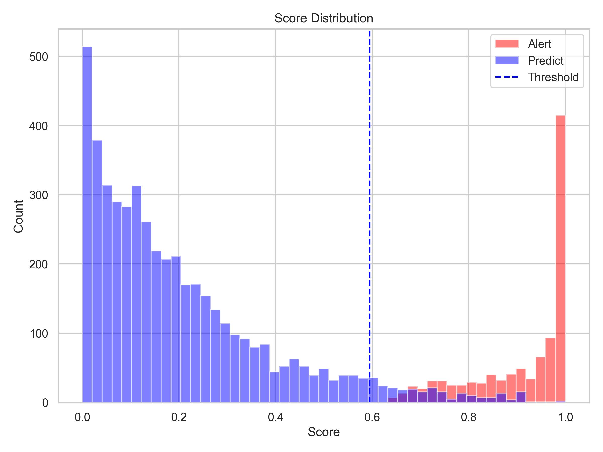

# Model

此資料夾用於警示帳戶偵測模型的建立、警示分數分布圖生成，以及最終結果 CSV 的輸出。

## 程式說明（detector.py）

- 功能：根據設定的 `config`，對帳戶進行警示偵測，繪製分數分布圖，並輸出最終 CSV 結果
- 主要函式：
    - `alert_acct_detector`：使用 PU Bagging 隨機森林模型計算警示帳戶分數
    - `plot_distribution`：將警示帳戶與待偵測帳戶的分數分布繪製成圖
    - `save_result`：依據分數百分位產生最終警示標籤，並輸出 CSV

## 警示分數分布圖（detector.jpg）

