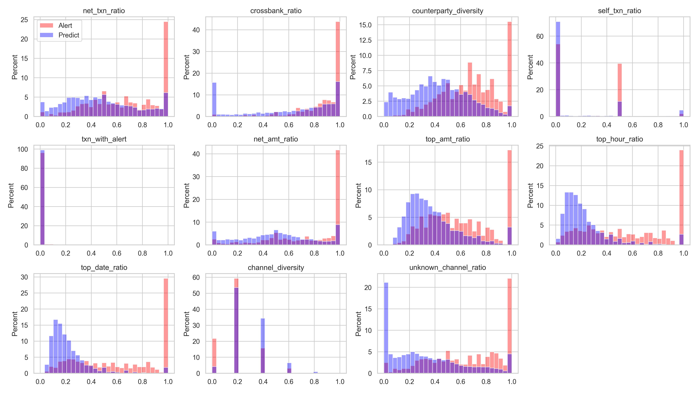

# Preprocess

此資料夾用於帳戶交易資料的特徵建構，以及生成特徵分布比較圖，用於觀察警示帳戶與待偵測帳戶的差異。

## 程式說明（features.py）

- 功能：計算帳戶交易特徵，並繪製特徵分布比較圖
- 主要函式：
    - `build_acct_features`：為帳戶計算交易相關特徵，包括交易數量、金額比例、跨行交易比例、交易對象多樣性、自我交易比例等
    - `plot_features`：將警示帳戶與待偵測帳戶的各特徵分布繪製成特徵分布比較圖

## 特徵分布比較圖（features.jpg）

